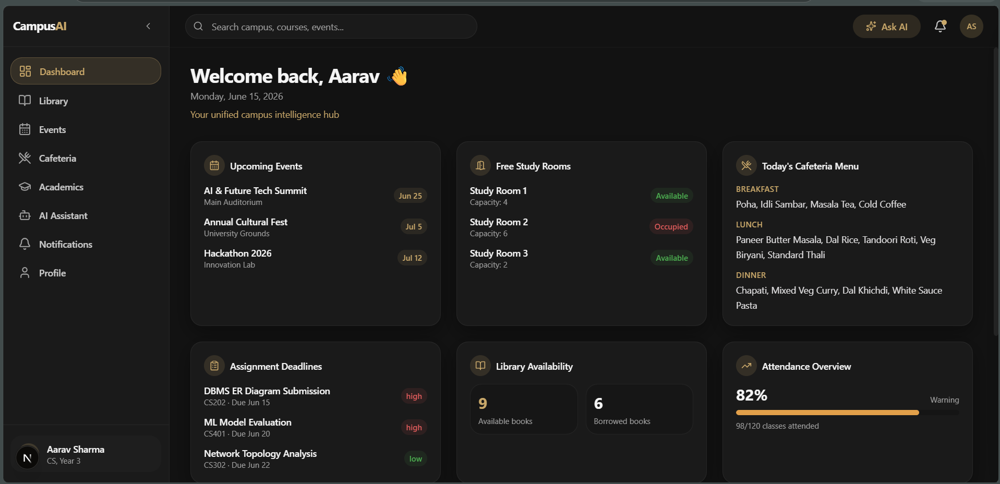
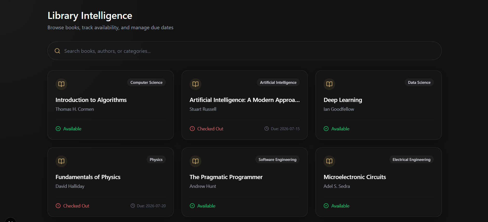
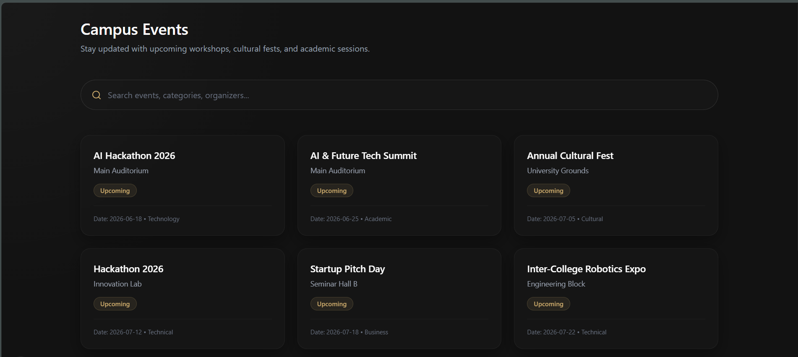
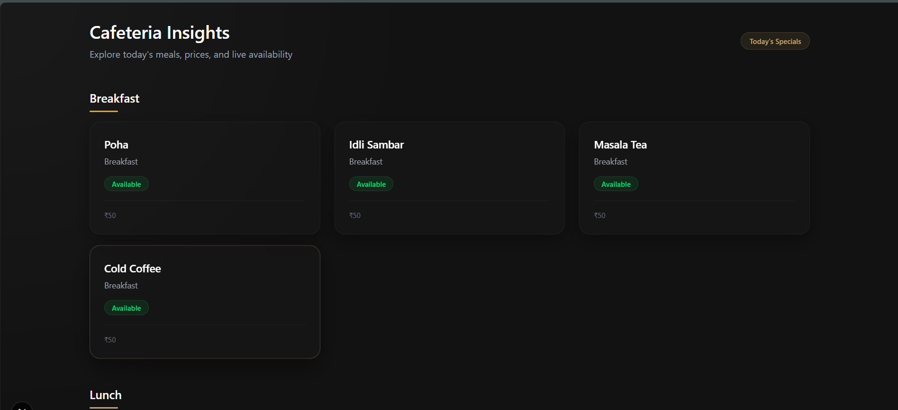
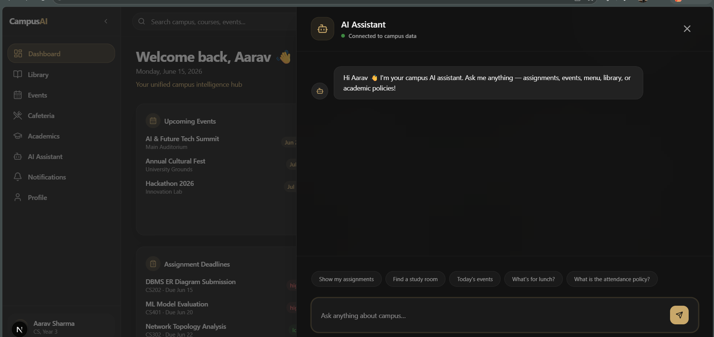
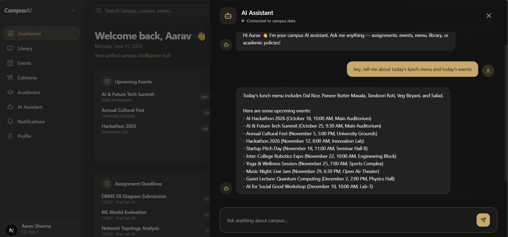

# 🎓 Unified Campus Intelligence Dashboard with AI Assistant

<div align="center">


**An AI-powered campus super-app unifying student services into a single intelligent platform**

[🎥 Watch Demo](https://drive.google.com/drive/folders/15zPUgZBB3W_iB0HioG96boLWGhyldD0D?usp=drive_link) · [📦 Frontend Docs](#-frontend-architecture) · [⚙️ Backend Docs](#️-backend-architecture) · [🚀 Get Started](#-installation-guide)

</div>

---

## 📌 Project Overview

The **Unified Campus Intelligence Dashboard** is a full-stack AI-powered platform that consolidates fragmented campus services into one seamless experience. Students no longer need to juggle multiple portals — everything they need is accessible from a single intelligent dashboard, enhanced by a conversational AI assistant capable of understanding intent and orchestrating real-time data retrieval across multiple backend microservices.

### Core Modules

| Module | Description |
|---|---|
| 📚 Library | Book search, availability, due dates |
| 🍽️ Cafeteria | Daily menus, dietary filters |
| 🎉 Events | Campus event listings and schedules |
| 🎓 Academics | Grades, schedule, handbook Q&A via semantic search |
| 🤖 AI Assistant | Multi-tool orchestration with context-aware responses |

---

## 💡 Why This Project Matters

University students typically interact with 5–7 disconnected portals daily — LMS systems, library catalogs, cafeteria apps, event boards, and academic handbooks. This fragmentation causes cognitive overhead, missed deadlines, and poor engagement.

This project solves that by introducing a **unified intelligence layer** — an AI assistant backed by a microservice architecture that fetches, aggregates, and presents relevant information in real time. The system is designed not just as a convenience tool but as a scalable blueprint for AI-augmented institutional software.

Key differentiators:
- **Multi-tool AI orchestration** — the assistant identifies user intent and concurrently queries relevant services
- **Semantic policy retrieval** — students can ask natural language questions about academic policies
- **Microservice isolation** — each campus service runs as an independent MCP (Microservice Control Plane) enabling fault tolerance and independent scaling
- **Production-ready architecture** — async-first, cleanly typed, modular, and deployable on modern cloud platforms

---

## 🛠️ Tech Stack

### Frontend

| Technology | Role |
|---|---|
| Next.js 15 (App Router) | React framework with server-side routing |
| React + TypeScript | Strongly-typed component architecture |
| Tailwind CSS | Utility-first responsive styling |
| Lucide React | Icon system |
| clsx + tailwind-merge | Conditional class management |
| class-variance-authority | Component variant system |

### Backend

| Technology | Role |
|---|---|
| FastAPI | High-performance async REST framework |
| Uvicorn | ASGI server for FastAPI |
| Pydantic | Data validation and schema enforcement |
| Python AsyncIO | Concurrent tool execution |
| CORS Middleware | Secure cross-origin request handling |

### AI / ML

| Technology | Role |
|---|---|
| OpenAI API (GPT-4) | Intent detection, tool selection, response generation |
| Transformers (HuggingFace) | NLP embedding pipeline |
| Sentence Transformers | Semantic similarity computation |
| Semantic Chunk Retrieval | Policy & handbook Q&A via vector search |
| Tool Calling Architecture | Structured multi-tool AI orchestration |

### DevOps & Tooling

| Tool | Role |
|---|---|
| Git + GitHub | Version control and collaboration |
| Vercel | Frontend deployment (CI/CD) |
| Render | Backend microservice hosting |
| Python venv | Isolated Python environment management |
| npm / pip | Package management |

---

## 📦 Important Dependencies

### Frontend Installation

```bash
npm install next react react-dom
npm install typescript
npm install tailwindcss
npm install lucide-react
npm install clsx
npm install class-variance-authority
npm install tailwind-merge
```

### Backend — Virtual Environment Setup

**Windows:**
```bash
python -m venv venv
venv\Scripts\activate
```

**Linux / macOS:**
```bash
python3 -m venv venv
source venv/bin/activate
```

### Backend — Python Packages

```bash
pip install fastapi          # Core async REST framework
pip install uvicorn          # ASGI server
pip install pydantic         # Schema validation
pip install python-dotenv    # Environment variable loading
pip install requests         # HTTP utility
pip install httpx            # Async MCP inter-service communication
pip install openai           # GPT-4 API integration
pip install transformers     # HuggingFace NLP embedding pipeline
pip install sentence-transformers  # Semantic similarity / vector search
pip install numpy            # Numerical operations for embedding math
```

#### Package Purpose Reference

| Package | Purpose |
|---|---|
| `fastapi` | REST API framework for all microservices and orchestrator |
| `uvicorn` | Serves FastAPI apps as ASGI processes |
| `pydantic` | Request/response schema enforcement |
| `httpx` | Async HTTP client for MCP-to-MCP communication |
| `openai` | Calls GPT-4 for intent detection and response synthesis |
| `transformers` | Loads HuggingFace models for text embeddings |
| `sentence-transformers` | Computes cosine similarity for semantic search |
| `python-dotenv` | Loads `.env` variables securely at runtime |
| `numpy` | Vector math for embedding similarity computations |

---

## 🖥️ Frontend Architecture

```
campus-dashboard/
├── app/
│   ├── layout.tsx              # Root layout — fonts, global wrappers, metadata
│   ├── globals.css             # Tailwind base imports and CSS resets
│   ├── page.tsx                # Main dashboard landing page
│   └── academics/
│       └── page.tsx            # Dedicated academics view with grade tracking
│
├── components/
│   ├── layout/
│   │   ├── sidebar.tsx         # Navigation sidebar with module links
│   │   └── navbar.tsx          # Top bar with user info and quick actions
│   │
│   ├── dashboard/
│   │   ├── dashboard-card.tsx  # Reusable card wrapper for each module widget
│   │   └── widgets.tsx         # Cafeteria, library, events summary widgets
│   │
│   └── ai/
│       └── assistant-panel.tsx # Chat interface — sends prompts, displays AI responses
│
├── lib/
│   ├── mock/
│   │   ├── academics.ts        # Mock academic data (grades, schedule)
│   │   ├── cafeteria.ts        # Mock cafeteria menu data
│   │   ├── events.ts           # Mock campus events data
│   │   └── library.ts          # Mock library book inventory
│   │
│   └── utils.ts                # Shared utility functions (cn(), formatters)
│
└── tailwind.config.ts          # Tailwind theme configuration and custom tokens
```

**Folder Roles:**
- `app/` — Next.js 15 App Router pages; each subfolder is an automatic route
- `components/layout/` — Structural chrome shared across all pages
- `components/dashboard/` — Data display widgets consumed by the dashboard page
- `components/ai/` — The AI assistant chat panel, connected to the FastAPI orchestrator
- `lib/mock/` — Type-safe mock data for frontend prototyping and development
- `lib/utils.ts` — Utility helpers including the `cn()` classname merger

---

## ⚙️ Backend Architecture

```
backend/
├── app/
│   └── ai/
│       ├── main.py             # FastAPI app entry point for AI orchestrator
│       ├── router.py           # POST /ai/chat route definition
│       ├── orchestrator.py     # Core orchestration logic — calls GPT-4, manages tool loop
│       ├── tool_executor.py    # Executes selected tools via async MCP calls (httpx)
│       ├── tool_registry.py    # Registry of all available tools and their schemas
│       ├── schemas.py          # Pydantic models for AI chat request/response
│       ├── prompts.py          # System prompts for GPT-4 tool orchestration
│       └── utils.py            # Shared helpers for response formatting and logging
│
└── mcp/
    ├── library/
    │   ├── main.py             # FastAPI app for Library MCP (port 8001)
    │   ├── routes.py           # GET /library endpoint
    │   ├── services.py         # Business logic for book queries
    │   ├── schemas.py          # Pydantic models for book data
    │   ├── utils.py            # Library-specific helpers
    │   └── data/
    │       └── books.json      # Static book inventory data
    │
    ├── events/
    │   ├── main.py             # FastAPI app for Events MCP (port 8002)
    │   ├── routes.py           # GET /events endpoint
    │   ├── services.py         # Event filtering and retrieval logic
    │   ├── schemas.py          # Pydantic models for event data
    │   ├── utils.py            # Events-specific helpers
    │   └── data/
    │       └── events.json     # Campus events dataset
    │
    ├── cafeteria/
    │   ├── main.py             # FastAPI app for Cafeteria MCP (port 8003)
    │   ├── routes.py           # GET /cafeteria endpoint
    │   ├── services.py         # Menu retrieval and meal filtering logic
    │   ├── schemas.py          # Pydantic models for menu data
    │   ├── utils.py            # Cafeteria-specific helpers
    │   └── data/
    │       └── menu.json       # Daily cafeteria menu dataset
    │
    └── academics/
        ├── main.py             # FastAPI app for Academics MCP (port 8004)
        ├── routes.py           # GET /academics endpoint
        ├── services.py         # Grade/schedule retrieval and handbook search
        ├── schemas.py          # Pydantic models for academic data
        ├── utils.py            # Academics-specific helpers
        ├── embeddings.py       # Generates/loads embeddings for handbook chunks
        └── data/
            ├── academic_handbook_chunks.json
            └── academics_data.json
```

| File | Role |
|---|---|
| `orchestrator.py` | Sends the user prompt + tool schemas to GPT-4, interprets tool calls, drives the response loop |
| `tool_registry.py` | Maintains a registry of available tools with their descriptions and input schemas |
| `tool_executor.py` | Makes async HTTP calls to the appropriate MCP service based on selected tools |
| `embeddings.py` | Loads `sentence-transformers` model, generates embeddings for handbook chunks |
| `prompts.py` | Stores the system prompt instructing GPT-4 on tool usage and response style |
| `schemas.py` | Defines strict input/output shapes using Pydantic for that module's data |

---

## 🏗️ System Architecture

```
┌─────────────────────────────────────────────────────────┐
│                    FRONTEND (Port 3000)                  │
│               Next.js 15 + React + TypeScript           │
│  ┌──────────┐  ┌──────────┐  ┌──────────┐  ┌────────┐ │
│  │ Dashboard│  │ Academics│  │  Events  │  │Library │ │
│  └──────────┘  └──────────┘  └──────────┘  └────────┘ │
│                      ┌──────────────┐                   │
│                      │  AI Panel    │                   │
│                      └──────┬───────┘                   │
└─────────────────────────────┼───────────────────────────┘
                              │ POST /ai/chat
                              ▼
┌─────────────────────────────────────────────────────────┐
│              AI ORCHESTRATOR (Port 8000)                 │
│                     FastAPI + GPT-4                      │
│  ┌─────────────┐  ┌──────────────┐  ┌───────────────┐  │
│  │  router.py  │→ │orchestrator  │→ │ tool_registry │  │
│  └─────────────┘  └──────┬───────┘  └───────────────┘  │
│                          │                               │
│                   ┌──────▼────────┐                     │
│                   │ tool_executor │                      │
│                   └──────┬────────┘                     │
└──────────────────────────┼──────────────────────────────┘
                           │ asyncio.gather() — parallel calls
          ┌────────────────┼──────────────────┐────────────┐
          ▼                ▼                  ▼            ▼
┌──────────────┐  ┌──────────────┐  ┌──────────────┐  ┌──────────────┐
│ Library MCP  │  │  Events MCP  │  │Cafeteria MCP │  │Academics MCP │
│  Port 8001   │  │  Port 8002   │  │  Port 8003   │  │  Port 8004   │
│  books.json  │  │ events.json  │  │  menu.json   │  │ embeddings   │
└──────────────┘  └──────────────┘  └──────────────┘  └──────────────┘
```

---

## 🔌 Port Mapping

| Service | Port | Technology |
|---|---|---|
| Frontend | `3000` | Next.js Dev Server |
| AI Orchestrator | `8000` | FastAPI + Uvicorn |
| Library MCP | `8001` | FastAPI + Uvicorn |
| Events MCP | `8002` | FastAPI + Uvicorn |
| Cafeteria MCP | `8003` | FastAPI + Uvicorn |
| Academics MCP | `8004` | FastAPI + Uvicorn |

**Why separate ports?**
Each service runs as a fully independent process. This enables:
- **Fault isolation** — a crash in the Events service doesn't affect Library or Cafeteria
- **Independent scaling** — high-traffic services can be scaled without affecting others
- **Independent deployment** — services can be updated without downtime on others
- **True microservice semantics** — services communicate only over HTTP with no shared state

---

## 🤖 How the AI Works Internally

```
1. User enters a prompt in the AI Panel
         ↓
2. POST /ai/chat sends the message to the Orchestrator
         ↓
3. Orchestrator sends prompt + tool schemas to GPT-4
         ↓
4. GPT-4 identifies user intent and selects relevant tools
         ↓
5. Tool Registry provides tool definitions (name, description, parameters)
         ↓
6. Tool Executor fires selected tool calls concurrently via asyncio.gather()
         ↓
7. MCP services return structured JSON responses
         ↓
8. Aggregated results are passed back to GPT-4 for synthesis
         ↓
9. Final natural language answer returned to the user
```

**Example:** User asks _"What's for lunch today and is the library open?"_
- GPT-4 detects two intents: `cafeteria_query` and `library_status`
- Fires `GET /cafeteria` and `GET /library` simultaneously via `asyncio.gather()`
- GPT-4 synthesizes both responses into one natural language answer

---

## 🚀 Installation Guide

```bash
git clone <repo-url>
cd campus-dashboard
```

**Frontend:**
```bash
npm install
npm run dev
npm run build
npm start
```

**Backend:**
```bash
cd backend
python -m venv venv
venv\Scripts\activate       # Windows
source venv/bin/activate    # Linux/macOS
pip install -r requirements.txt
```

---

## ▶️ Running All Services Locally

> ⚠️ All 6 services must run simultaneously in separate terminal windows.

```bash
# Frontend
cd campus-dashboard && npm run dev

# AI Orchestrator
cd backend/app/ai && uvicorn main:app --reload --port 8000

# Library MCP
cd backend/mcp/library && uvicorn main:app --reload --port 8001

# Events MCP
cd backend/mcp/events && uvicorn main:app --reload --port 8002

# Cafeteria MCP
cd backend/mcp/cafeteria && uvicorn main:app --reload --port 8003

# Academics MCP
cd backend/mcp/academics && uvicorn main:app --reload --port 8004
```

---

## 📡 API Endpoints

| Method | Endpoint | Service | Description |
|---|---|---|---|
| `GET` | `/library` | Library MCP (8001) | Fetch book inventory and availability |
| `GET` | `/events` | Events MCP (8002) | Fetch upcoming campus events |
| `GET` | `/cafeteria` | Cafeteria MCP (8003) | Fetch today's cafeteria menu |
| `GET` | `/academics` | Academics MCP (8004) | Fetch student grades and schedule |
| `POST` | `/ai/chat` | Orchestrator (8000) | Send a prompt; receive an AI-generated response |

---

## 🔍 Semantic Search Workflow

```
Academic Handbook (PDF / raw text)
         ↓
1. Chunking — Split into ~300-token overlapping segments
         ↓
2. Embedding — Each chunk encoded via sentence-transformers
         ↓
3. Storage — Saved as vectors in academic_handbook_chunks.json
         ↓
4. Query — User question encoded to a query vector
         ↓
5. Similarity Search — Cosine similarity across all chunk vectors
         ↓
6. Retrieval — Top-K most relevant chunks returned
         ↓
7. Synthesis — GPT-4 answers using retrieved context
```

---

## 🌐 Deployment

**Frontend — Vercel:**
```bash
npm install -g vercel
vercel --prod
```
Connect GitHub repo → set `NEXT_PUBLIC_API_URL` → auto-deploys on push to `main`.

**Backend — Render:**
Create a Web Service per MCP on [render.com](https://render.com) with these start commands:
- Orchestrator: `uvicorn app.ai.main:app --host 0.0.0.0 --port 8000`
- Library: `uvicorn mcp.library.main:app --host 0.0.0.0 --port 8001`
- Events: `uvicorn mcp.events.main:app --host 0.0.0.0 --port 8002`
- Cafeteria: `uvicorn mcp.cafeteria.main:app --host 0.0.0.0 --port 8003`
- Academics: `uvicorn mcp.academics.main:app --host 0.0.0.0 --port 8004`

---

## 🔐 Environment Variables

```env
OPENAI_API_KEY=sk-...
NEXT_PUBLIC_API_URL=http://localhost:8000
```

| Variable | Description |
|---|---|
| `OPENAI_API_KEY` | OpenAI API key for GPT-4 orchestration |
| `NEXT_PUBLIC_API_URL` | Base URL of AI Orchestrator used by the frontend |

> ⚠️ Never commit `.env` to version control.

---

## 🎥 Watch Demo

[](https://drive.google.com/drive/folders/15zPUgZBB3W_iB0HioG96boLWGhyldD0D?usp=drive_link)

---

## 🖼️ Screenshots

### 🏠 Dashboard Overview


### 📚 Library Intelligence


### 🎉 Campus Events


### 🍽️ Cafeteria Insights


### 🤖 AI Assistant — Connected State


### 🤖 AI Assistant — Multi-Tool Response


---

## 🧱 Challenges Faced

| Challenge | How It Was Addressed |
|---|---|
| **Multi-tool orchestration** | Tool registry pattern where GPT-4 selects from declarative tool schemas |
| **Parallel async execution** | `asyncio.gather()` fires all MCP calls concurrently |
| **Inter-service communication** | Standardized HTTP interfaces with Pydantic schemas + `httpx` |
| **Semantic retrieval accuracy** | Overlapping chunk windows + cosine similarity thresholds |
| **Frontend-backend sync** | TypeScript interfaces on frontend matched to Pydantic models on backend |

---

## 📚 Learning Outcomes

- **Next.js 15 App Router** — File-based routing, layouts, server components
- **FastAPI Microservices** — Independent async-first APIs with schema validation
- **Async Orchestration** — Concurrent service calls via `asyncio` and `httpx`
- **AI Tool Calling** — GPT-4 tool-use loop with structured schemas
- **Semantic Retrieval (RAG)** — RAG pipeline with `sentence-transformers`
- **Cloud Deployment** — Multi-service deployment across Vercel and Render

---

## 📈 Scalability Design

| Principle | Implementation |
|---|---|
| **Independent MCP Scaling** | Each service scales independently based on load |
| **Plug-and-Play Modules** | New services added via `tool_registry.py` only |
| **Service Isolation** | No shared in-process state; HTTP-only communication |
| **Maintainability** | Each MCP owns its own schemas, services, and routes |
| **AI Extensibility** | New tools only require updating registry and prompts |

---

## ⚠️ Known Limitations

- **Mock Data** — Static JSON datasets; no live campus system integration
- **No Authentication** — No login, session management, or RBAC
- **No Database Persistence** — State is ephemeral; resets on restart

---

## 🔮 Future Improvements

| Feature | Description |
|---|---|
| 🔐 **Authentication** | JWT-based login with student/faculty/admin roles |
| 🗄️ **Real Database** | PostgreSQL via SQLAlchemy |
| 🔔 **Push Notifications** | Real-time alerts for deadlines and events |
| 👥 **Role-Based Access** | Separate dashboards per user type |
| 🧠 **Recommendation Engine** | Personalized suggestions based on history |
| 📱 **Mobile App** | React Native companion app |
| 📊 **Analytics Dashboard** | Admin-facing usage metrics |
| 🔗 **Real MCP Integration** | Live ERP, LMS, and library system connections |


---


<div align="center">

Built with ❤️ as a full-stack AI systems project

</div>
